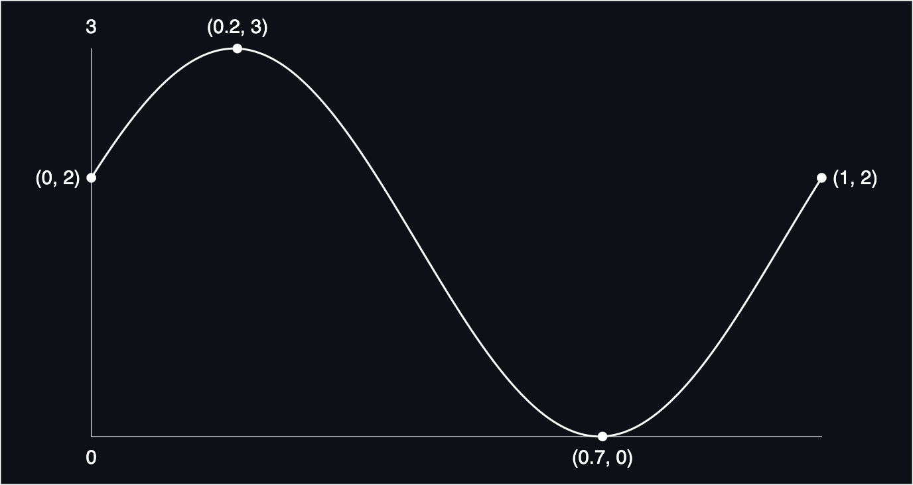

# Background

In game dev, generative art, and creative coding, `sine` is a ubiquitous function that is often used as a spring-like oscillator for a given parameter.

On its own, `sine` has some undesirable qualities which most developers will encounter and adjust in isolated situations. The purpose of *Bounded Sine* is to solve these issues up-front in a reusable way:

| Sine                    | Bounded Sine                                    | Benefits                                                    |
| ----------------------- | ----------------------------------------------- | ----------------------------------------------------------- |
| Period = `2 * PI`       | Period = `period`, which defaults to 1.         | No longer need to work in radians. Period can be any value. |
| Is bounded by `[-1, 1]` | Is bounded by `[yMin, yMax]`                    | Bounds can now match the min/max value of a parameter.      |
| `fx(0) = 0`             | `fx(0) = yStart` where `yMin <= yStart <= yMax` | Starting value can be set rather than it being fixed.       |

Here's an example:

```js
const fn = boundedSine({ yStart: 2, yMax: 3, yMin: 0 });
```



Bounded Sine also takes `period` and `invert` parameters:

```js
const fn = boundedSine({ yStart: 2, yMax: 3, yMin: 0, period: 10, invert: true });
```


# API

| Parameter            | Default | Description                                        |
| -------------------- | ------- | -------------------------------------------------- |
| `options`            | `{}`    | `boundedSine` takes a single options object.       |
| `options.yStart`     | `0`     | The value of `fx(0)` before translations.          |
| `options.yMin`       | `-1`    | The minimum y-value before translations.           |
| `options.yMax`       | `1`     | The maximum y-value before translations.           |
| `options.period`     | `1`     | The length of one cycle of the curve.              |
| `options.translateX` | `0`     | Translation applied in the x-direction.            |
| `options.translateY` | `0`     | Translation applied in the y-direction.            |
| `options.invert`     | `false` | Reflect the sine curve around the average y-value. |

# Installation and Usage

`yarn add bounded-sine`

```js
import { boundedSine } from "bounded-sine";
const fn = boundedSine({ yStart: 2, yMax: 3, yMin: 0 });
const yStart = fn(0)
```
